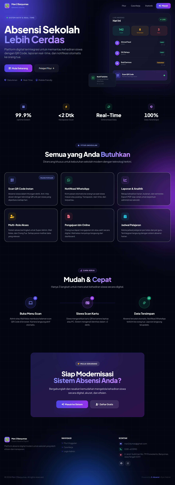
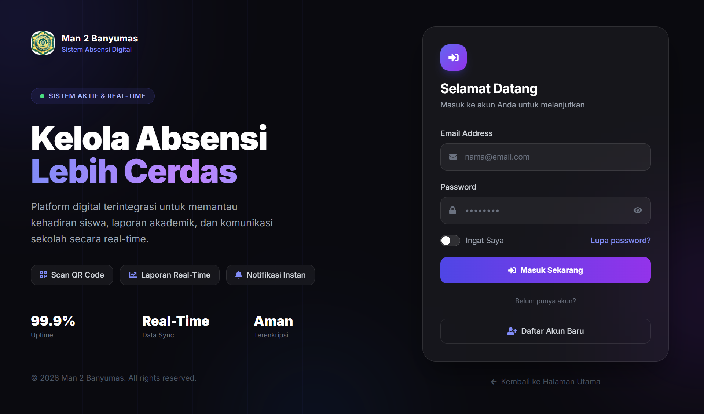
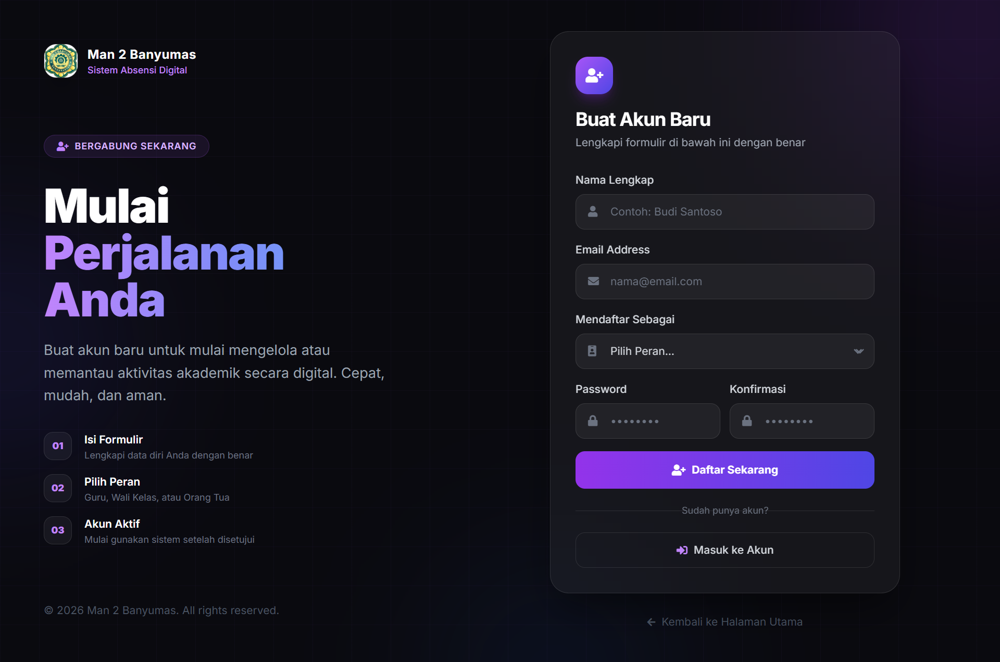
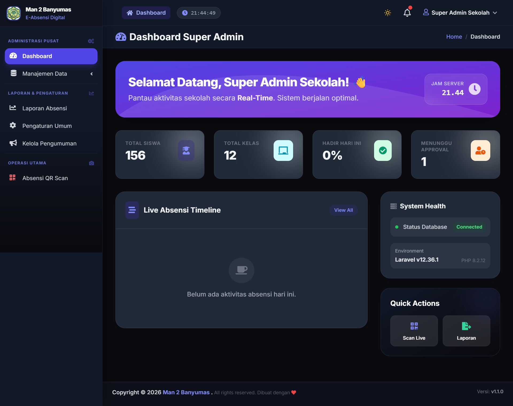
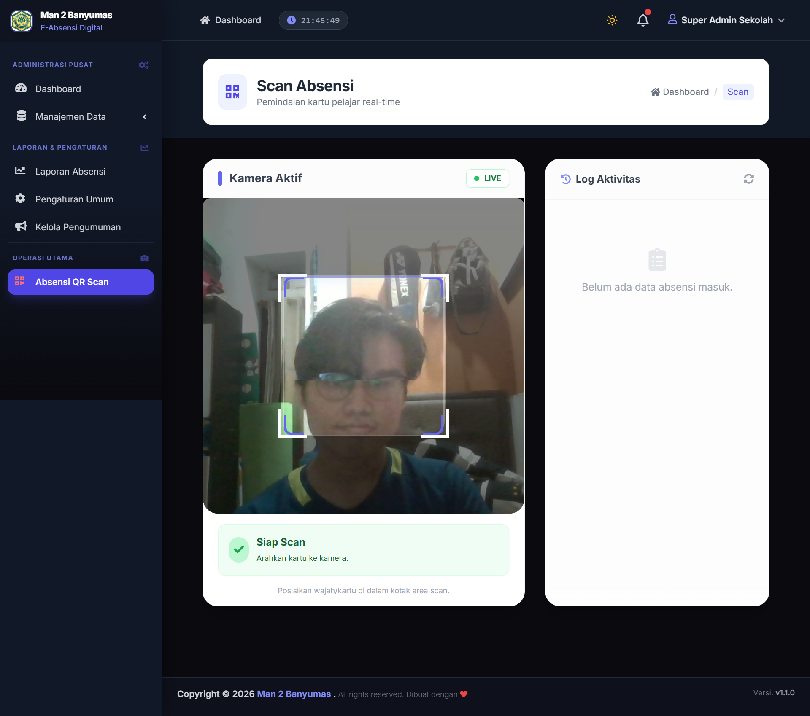
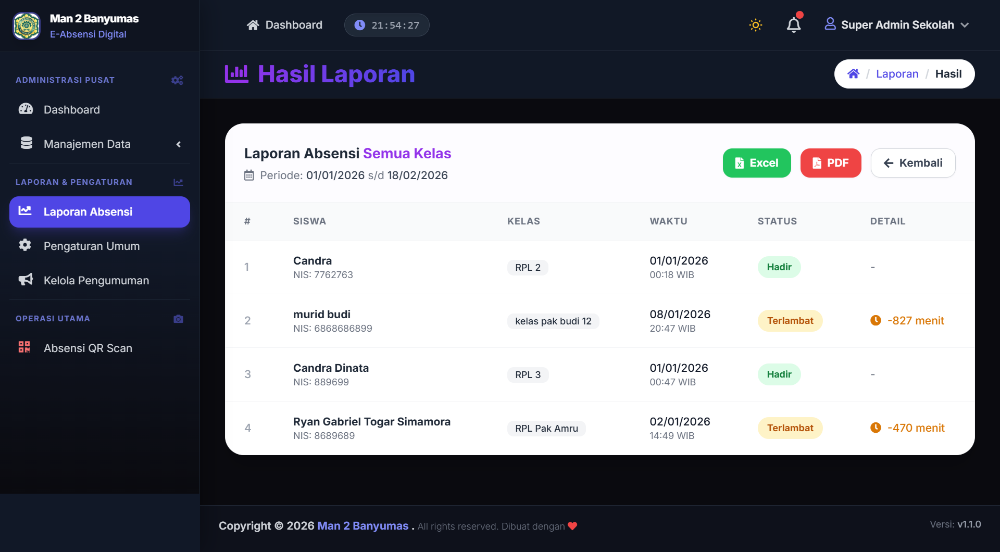

# 📋 E-Absensi Siswa

Sistem manajemen absensi siswa digital berbasis QR Code dengan notifikasi real-time. Dibangun dengan **Laravel 11**, **Tailwind CSS**, dan **Alpine.js**.


---

## 📸 Tampilan Aplikasi

<table>
  <tr>
    <td align="center"><strong>🏠 Landing Page</strong></td>
    <td align="center"><strong>🔐 Halaman Login</strong></td>
  </tr>
  <tr>
    <td></td>
    <td></td>
  </tr>
  <tr>
    <td align="center"><strong>📝 Halaman Register</strong></td>
    <td align="center"><strong>📊 Dashboard Admin</strong></td>
  </tr>
  <tr>
    <td></td>
    <td></td>
  </tr>
  <tr>
    <td align="center"><strong>📷 Scan QR Code</strong></td>
    <td align="center"><strong>📋 Laporan Absensi</strong></td>
  </tr>
  <tr>
    <td></td>
    <td></td>
  </tr>
</table>

---

## ✨ Fitur Utama

- 🔐 **Multi-Role Auth** — Super Admin, Wali Kelas, Orang Tua
- 📱 **Scan QR Code** — Absensi masuk & pulang via kamera
- 💬 **Notifikasi WhatsApp** — Otomatis ke orang tua saat siswa absen
- 📊 **Laporan & Rekap** — Harian, bulanan, semester (export PDF)
- 📝 **Pengajuan Izin Online** — Orang tua ajukan izin/sakit digital
- 🗓️ **Jadwal Pelajaran** — Kelola jadwal per kelas & guru
- 🌙 **Dark Mode** — Toggle light/dark dengan preferensi tersimpan
- 📣 **Pengumuman** — Kelola pengumuman sekolah

---

## 🚀 Instalasi Lokal

### Prasyarat
- PHP >= 8.2
- Composer
- MySQL 8+
- Node.js >= 18 & npm

### Langkah-langkah

```bash
# 1. Clone repository
git clone https://github.com/USERNAME/e-absensi-siswa.git
cd e-absensi-siswa

# 2. Install dependencies PHP
composer install

# 3. Install dependencies Node.js
npm install

# 4. Salin file environment
cp .env.example .env

# 5. Generate application key
php artisan key:generate

# 6. Konfigurasi database di .env
# DB_DATABASE=e_absensi_siswa
# DB_USERNAME=root
# DB_PASSWORD=

# 7. Jalankan migrasi & seeder
php artisan migrate --seed

# 8. Buat symbolic link storage
php artisan storage:link

# 9. Build assets
npm run build

# 10. Jalankan server
php artisan serve
```

Buka browser: `http://127.0.0.1:8000`

---

## 👤 Akun Default (Seeder)

| Role | Email | Password |
|------|-------|----------|
| Super Admin | admin@example.com | password |

---

## 🛠️ Tech Stack

| Layer | Teknologi |
|-------|-----------|
| Backend | Laravel 11, PHP 8.2 |
| Frontend | Blade, Tailwind CSS v3, Alpine.js |
| Database | MySQL 8 |
| Build Tool | Vite |
| Icons | Font Awesome 6 |
| Charts | Chart.js |
| Alerts | SweetAlert2 |

---

## 📁 Struktur Direktori Penting

```
├── app/
│   ├── Http/Controllers/     # Controllers per role
│   └── Models/               # Eloquent models
├── database/
│   ├── migrations/           # Schema database
│   └── seeders/              # Data awal
├── resources/
│   ├── css/app.css           # Tailwind + custom CSS
│   ├── js/app.js             # Alpine.js bootstrap
│   └── views/
│       ├── admin/            # Views Super Admin
│       ├── walikelas/        # Views Wali Kelas
│       ├── orangtua/         # Views Orang Tua
│       ├── auth/             # Login, Register
│       ├── layouts/          # Layout utama & partials
│       └── landing.blade.php # Landing page
└── routes/web.php            # Definisi routes
```

---

## ⚙️ Konfigurasi Environment

Salin `.env.example` ke `.env` dan sesuaikan:

```env
APP_NAME="E-Absensi Siswa"
APP_URL=http://localhost

DB_CONNECTION=mysql
DB_HOST=127.0.0.1
DB_PORT=3306
DB_DATABASE=e_absensi_siswa
DB_USERNAME=root
DB_PASSWORD=

# WhatsApp Gateway (Fonnte/Wablas)
WHATSAPP_TOKEN=your_token_here
WHATSAPP_SENDER=your_number_here
```

---

## 📄 Lisensi

MIT License — bebas digunakan untuk keperluan pendidikan.

---

> Dibuat dengan ❤️ untuk kemajuan pendidikan Indonesia.
